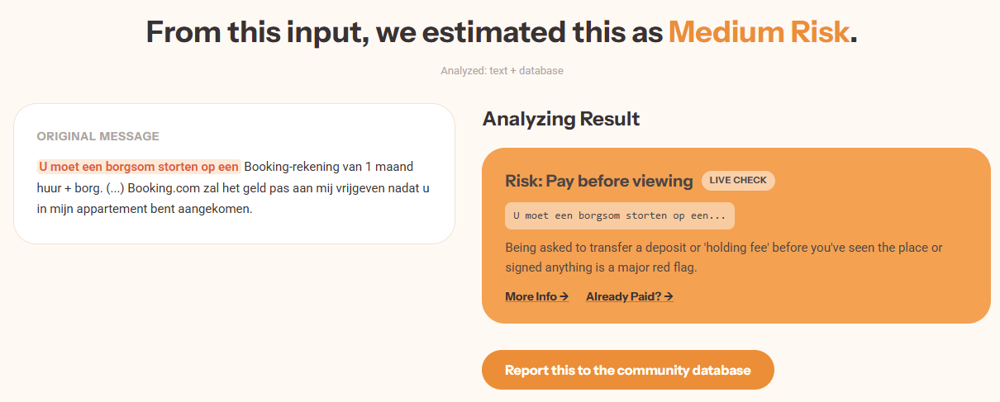
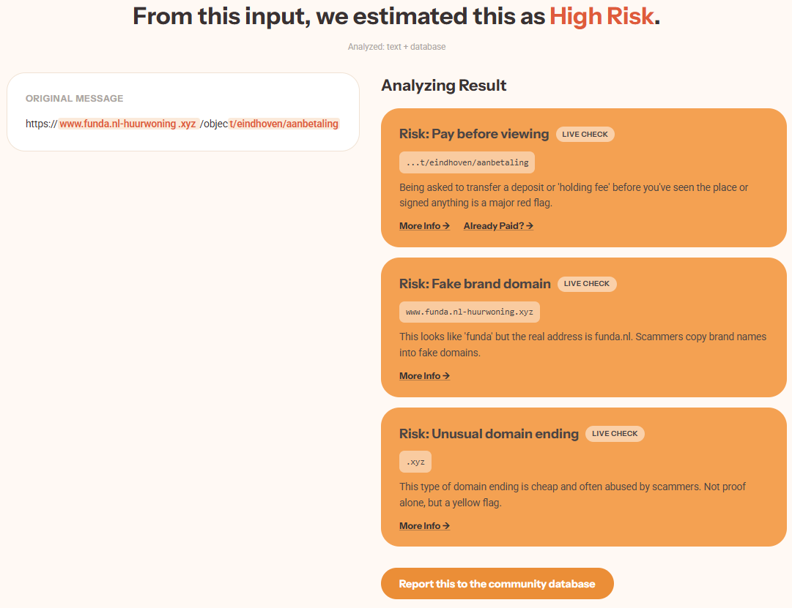

# 🏠 SafeLanding — full-stack rental-scam assistant

A rental-scam detector for **non-native speakers** in the Netherlands, backed by a
persistent **community threat-intelligence database**. Paste a message, a link, or
a screenshot; get one verdict explained in your own language.

| Text analysis | URL analysis |
|---|---|
|  |  |

**Stack:** Python · FastAPI · SQLite · Docker · vanilla JS (no framework)

**What's in here**
- REST API with 10 endpoints, Pydantic request/response models, auto-generated OpenAPI docs
- A keyword-retrieval engine (TF-IDF + identifier matching) written from scratch on the standard library — no numpy, no scikit-learn
- A fusion layer that merges live heuristics with database intelligence into one score, with a deliberate choice about which signals may drive the verdict
- Optional-dependency architecture: LLM and OCR are upgrades, not requirements — the app runs fully offline with zero configuration
- Trilingual UI and explanations (EN / 中文 / NL)
- SQLite persistence seeded from JSON, an admin review console, Docker packaging, 18 integration tests

---

This project merges two earlier pieces into one full-stack service:

- the **live analyzer** (FastAPI + a trilingual frontend) that inspects a
  message, link, or screenshot and explains what's wrong in your own language, and
- the **SafeLanding database** (SQLite + a dependency-free retrieval engine + an
  admin console) that remembers known scam patterns, documented cases, and
  community reports of specific scammers.

The live analyzer answers *"does this message look like a scam?"*.
The database answers *"have we seen this specific scammer or pattern before?"*.
Fusing them gives one verdict that is both pattern-aware and memory-aware.

---

## How the two halves connect

```
                       ┌──────────────────────────────────────────┐
   browser (JS) ──────►│  POST /api/analyze   (FastAPI)            │
   text / url / image  │                                          │
                       │  1. analysis.collect_signals()           │
                       │       • real URL heuristics              │
                       │       • text rules (or OpenAI if a key    │
                       │         is set) → tactics + weights       │
                       │       • OCR each screenshot → text        │
                       │     ...also returns the COMBINED text     │
                       │                                          │
                       │  2. safelanding.retrieve(combined_text)   │
                       │       • TF-IDF over patterns/cases/gaps   │
                       │       • match phone/email/address/name    │
                       │         against past community reports    │
                       │                  (SQLite)                 │
                       │                                          │
                       │  3. fusion.fuse() → ONE verdict           │
                       │       score = live signals                │
                       │             + reported-identifier matches │
                       │       enrichment (patterns/cases/actions) │
                       │       shown only when risk is established │
                       └──────────────────────────────────────────┘
```

Key design choice: **only the live signals and the *reported-identifier* matches
drive the numeric score.** A phone/email/address that already has a report is the
one piece of information the live detectors genuinely cannot know, so it counts —
a *verified* report alone forces a `dangerous` verdict. The free-text pattern/case
retrieval is used as **explanatory enrichment** (and is hidden entirely for clean
messages), because it would otherwise false-positive on benign text: its relevance
score is relative, so its top hit is always normalized to 1.0.

---

## Run it

Core app needs only `fastapi` + `uvicorn`. The retrieval engine and the SQLite
layer are pure standard library, so it runs fully offline with no API key.

```bash
cd backend
pip install -r requirements.txt
uvicorn main:app --reload --port 8000
```

Open:

- http://localhost:8000 — the analyzer (paste text, a link, or screenshots)
- http://localhost:8000/admin — the review console (cases / patterns / reports)
- http://localhost:8000/docs — auto-generated interactive API docs

The SQLite database is created at `data/safelanding.db` on first start, seeded
from the JSON files in `data/`. Delete that file to reseed from scratch.

### Offline by default, LLM/OCR as optional upgrades

The **rule engine is the default path**, not a fallback for when the LLM breaks.
Everything below degrades gracefully, so a clone with zero configuration still
produces the same verdicts on text and URLs:

| Capability | Without extras (default) | With the optional extra |
|---|---|---|
| URL heuristics | full rule checks, offline | unchanged |
| Text analysis | rule engine | `openai` installed **and** `OPENAI_API_KEY` set → LLM tactics |
| Screenshots | placeholder signal | `easyocr` (or `paddleocr`) installed → OCR'd text runs through the text analysis |

To install the optional extras:

```bash
pip install -r requirements-optional.txt
```

Diagnostics go through the stdlib `logging` module, so nothing is written to
stdout during normal operation. To inspect what OCR actually read, raise the
level before starting the app:

```python
import logging; logging.basicConfig(level=logging.DEBUG)
```

### Docker

```bash
docker build -t safelanding .
docker run -p 8000:8000 -v safelanding_data:/app/data safelanding
```

The volume persists submitted reports and admin edits across restarts.

### Try these

| Input | Expected |
|------|----------|
| `Hi, want to see the room this Saturday? We can sign the contract in person.` | **safe** — no signals, no scary panels |
| The "abroad / pay deposit today / many interested" message | **dangerous** — live tactics + matching patterns |
| `http://funda-secure-pay.info/login` | **dangerous** — real URL heuristics |
| A message containing a phone/email that's already reported | escalated by the database (pending → suspicious, verified → dangerous) |

Switch the language dropdown (English / 中文 / Nederlands) and the explanations
change with it.

---

## API

| Method & path | Purpose |
|---|---|
| `POST /api/analyze` | Fused analysis. Body: `text`, `url`, `images_base64[]`, `native_language`. |
| `POST /api/retrieve` | Raw keyword retrieval (`message`, `top_n`) for integrators. |
| `GET /api/cases` · `/api/patterns` · `/api/knowledge-gaps` · `/api/reports` | Read the database. |
| `POST /api/reports` | Submit a community report (stored as `Pending`). |
| `PUT /api/reports/{id}` | Admin review update. |
| `DELETE /api/reports/{id}` | Admin delete. |
| `PUT /api/cases/{id}` | Admin correction of a reference case. |
| `GET /api/health` | Liveness. |

The `/api/analyze` response carries both halves: `verdict`, `risk_score`,
`tactics[]` (each tagged `source: "live"` or `"database"`), plus
`reported_intelligence`, `matching_patterns[]`, `similar_cases[]`,
`likely_threat_actors[]`, and `recommended_actions[]`.

---

## Layout

```
safelanding/
├── backend/
│   ├── main.py                    FastAPI app: pages + fused analyze + full DB API
│   ├── fusion.py                  joins live signals with database intelligence  ← the merge
│   ├── analysis.py                live engine: URL rules + text rules/LLM + OCR
│   ├── models.py                  Pydantic request/response (incl. database fields)
│   ├── safelanding/               dependency-free data + retrieval package
│   │   ├── data_store.py          SQLite persistence, seeded from JSON
│   │   ├── retrieval.py           TF-IDF + identifier matching
│   │   ├── server.py              legacy stdlib server (kept; FastAPI replaces it)
│   │   └── cli.py                 `python -m safelanding.cli retrieve "..."`
│   ├── requirements.txt           core: fastapi + uvicorn + pydantic
│   └── requirements-optional.txt  LLM + OCR extras
├── frontend/index.html            analyzer UI (verdict + tactics + DB panels + report button)
├── static/admin.html              admin review console
├── data/                          JSON seeds (source of truth); safelanding.db is generated
├── demos/
│   ├── detection_demos/           screenshots of the app in action
│   └── sources/                   public case material behind the seed data
├── docs/                          data dictionary + example queries
├── tests/                         test_retrieval.py (engine) + test_fusion.py (integration)
├── Dockerfile
└── LICENSE
```

## Tests

```bash
PYTHONPATH=backend python -m unittest discover -s tests
```

## Known limitations & abuse considerations

This is a hackathon MVP, deliberately scoped. What I would fix before real use:

- **Admin write endpoints are unauthenticated.** Anyone can `PUT /api/reports/{id}`
  to mark a report Verified, and a verified report forces a `dangerous` verdict.
  A shared-token header (or proper sessions) is the minimum fix.
- **Report poisoning.** Anyone can submit a report against any phone/email.
  Partial mitigation in place: pending reports can never force `dangerous` on
  their own — only admin-verified ones can. Production needs rate limiting and
  reporter accountability.
- **No rate limiting** on `/api/analyze` or `/api/reports`.
- **Seed cases are annotated MVP records**, not verified, source-linked incidents.

## Notes

The JSON files in `data/` are seed data; runtime submissions and admin edits live
in `data/safelanding.db`. The reference patterns/cases/knowledge-gaps content is
English; the per-user explanations (verdict, tactics, tips) are localized to
English/中文/Nederlands.

